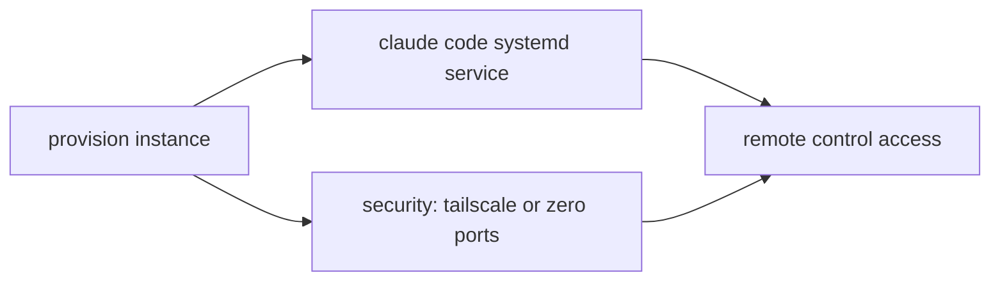
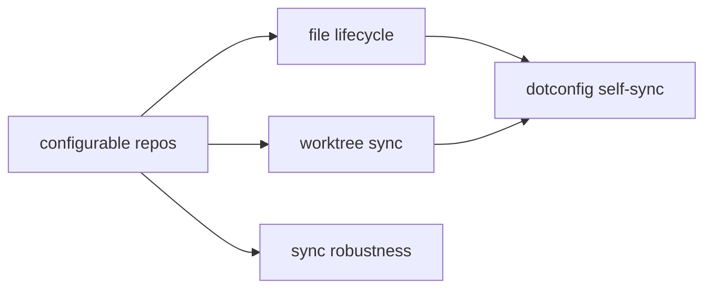

# Roadmap

## Tooling retirement

Use GitHub tracking and the verified existing VCS workflow. Preserve historical records and unrelated work. This cleanup is independent of planning implementation, not a prerequisite for it.

- [ ] Finish active dependency, skill, routing, and guidance retirement ([#76](https://github.com/0xgleb/dotconfig/issues/76))

## Shared cross-project planning

Maintain one shared weekly plan and daily planned-versus-actual view across project roles. Use flexible capacity targets without depending on provider throttling. Keep SPEC/ROADMAP, GitHub issues, and linked local tasks as the work hierarchy; notes and memories remain supporting context.

Draft behavior and acceptance criteria: [team planning spec](ai/pi/TEAM-PLANNING-SPEC.md). Tracking: [#75](https://github.com/0xgleb/dotconfig/issues/75).

This remains a design draft; no schedules or delivery are activated.

- [ ] Confirm the planning spec and coordinator
- [ ] Select durable plan representation and delivery adapter before implementation
- [ ] Configure participant-local delivery settings before activation
- [ ] Preserve weekly/daily commitments and revisions across restarts
- [ ] Produce one evidence-backed daily update and weekly retrospective/plan
- [ ] Apply authenticated priority corrections with role acknowledgment
- [ ] Reconcile substantive local work to GitHub issues, with explicit one-off exceptions

## Shared read-only plans

After owner-only planning works, expose a team-safe projection in a group chat without granting another human AI control. Remote hosting and multi-user authorization follow separately.

- [ ] Confirm the group destination and team-visible information boundary
- [ ] Deliver plan revisions without mirroring private owner or agent traffic
- [ ] Verify non-owner messages and callbacks cannot trigger AI work or mutate plans
- [ ] Spec remote multiplayer hosting and authorization before granting employee control
- [ ] Define shared cross-machine task claims before introducing a separate remote team bot

## Resilient private planning

After team planning, support private weekly and daily goals alongside agreed work commitments. Prefer flexible priorities and recovery from disruption over exhaustive timeboxing; preserve the boundary between team-visible commitments and private activities.

- [ ] Define fixed commitments, flexible goals, and explicit rescheduling proposals
- [ ] Import team commitments without leaking personal context back to the team
- [ ] Select the calendar and reminder integration before granting write access
- [ ] Apply only approved adjustments with conflict detection, idempotent retries, and visible partial failures

## Remote Claude Code instances

On-demand provisioned cloud instances running Claude Code with remote control
enabled, controllable from the web app or mobile app without SSH. Enables
background work streams while away from the laptop or working on higher-priority
tasks.

Security is non-negotiable — no unauthorized access. If Tailscale is needed to
avoid exposing ports, use it. If remote control makes SSH and open ports
unnecessary, skip them entirely.

- [ ] Terraform config to provision a DigitalOcean instance on demand
- [ ] NixOS config for the instance with Claude Code installed
- [ ] systemd service running Claude Code with remote control enabled
- [ ] Determine security model: Tailscale VPN vs zero exposed ports vs other
- [ ] `fj infra` subcommands to spin up/down instances
- [ ] Verify remote control works from web app and mobile app
- [ ] #41 — add Tailscale as homebrew cask (if needed for VPN mesh)

## Obsidian notes syncing

Bidirectional sync between st0x source repos and a unified Obsidian vault so all
markdown is browsable and editable from one place. Currently works for three
hardcoded repos with fswatch-based continuous monitoring via launchd.

- [x] Extract md-sync into standalone nix package (`nix run .#mdSync`)
- [x] Sync st0x repos (liquidity, issuance, rest.api) to per-repo subdirectories
- [x] fswatch-based continuous sync
- [x] Deploy as launchd service
- [x] Bidirectional sync (repo ↔ notes) with timestamp-based conflict resolution

### Configurable repo list

- [ ] Move hardcoded `repos=(liquidity issuance rest.api)` to a declarative Nix
      option so adding a repo is a one-line config change
- [ ] Auto-discover repos: scan `~/code/st0x/st0x.*` for git repos containing
      `.md` files instead of maintaining a manual list

### Worktree sync

- [ ] Detect `.worktrees/` directories inside each repo and sync their markdown,
      appending repo name to filenames per naming convention (`docs/file.md` →
      `docs/file.liquidity.md`)
- [ ] Watch for worktree creation/deletion and dynamically add/remove fswatch
      paths without restarting the service
- [ ] Handle worktree cleanup: remove notes subdirectory when a worktree is
      deleted

### File lifecycle

- [ ] Detect file deletion in repos (file tracked by git but removed from
      working tree) and remove the corresponding notes file
- [ ] Detect new `.md` files added to a repo — sync on next fswatch event
      without waiting for full `sync_all`
- [ ] Detect file deletion in notes and remove from repo (safeguard: only if the
      file is untracked or unchanged in git)
- [ ] Handle renames: detect via git and update the notes copy accordingly

### Dotconfig self-sync

- [ ] Sync `~/.config/*.md` → `notes/dotconfig/` (this repo's own markdown,
      including this roadmap)
- [ ] Exclude build artifacts and lock files

### Sync robustness

- [ ] Eliminate the one-bounce no-op: touch both files to the same timestamp
      after copying so the echo cycle doesn't fire
- [ ] Conflict detection: when both sides changed since last sync, log a warning
      instead of silently picking the newer file
- [ ] Atomic writes: write to temp file then rename to avoid partial reads
- [ ] Dedup fswatch events: multiple rapid events for the same file should
      coalesce into a single sync

### Obsidian frontmatter

- [ ] Inject YAML frontmatter on sync to notes (repo, tags for doc type,
      version)
- [ ] Strip frontmatter on sync back to repo so source files stay clean

### Logging and observability

- [ ] Structured log format with consistent fields (timestamp, direction, repo,
      file, adds, dels)
- [ ] Log rotation or size cap to prevent unbounded growth
- [ ] Health check: periodic heartbeat so absence of logs is distinguishable
      from "service died silently"

## Git hooks via git-hooks.nix

Declarative pre-commit hooks managed by git-hooks.nix so formatting, linting,
and checks run automatically on commit across all repos without manual setup.

- [ ] Add git-hooks.nix to the flake inputs
- [ ] Configure hooks (nixfmt, denofmt, etc.)
- [ ] Integrate with direnv so hooks activate per-project

## Not epic

- [ ] Remove `rsync` from `runtimeInputs` — replaced by `diff`+`cp` but still
      listed as a dependency
- [ ] Clean up `dump.md` planning doc once roadmap covers everything

## Emacs Graphite Plugin

Build a magit extension for Graphite (`magit-graphite.el`). Transient-based UI
wrapping `gt` commands with magit-style UX.

### Core transient

- [ ] Transient menu accessible from magit dispatch (`G` prefix or similar)
- [ ] `gt create`, `gt modify`, `gt submit`, `gt co`, `gt sync` wrappers
- [ ] Stack visualization (`gt ls` / `gt ll` output in a buffer)

### Magit integration

- [ ] Stack status section in magit-status buffer
- [ ] Per-branch PR status (draft/open/merged)
- [ ] Submit from magit with publish/draft toggle

### Full workflow

- [ ] `gt absorb` integration with magit staging
- [ ] `gt reorder` / `gt move` via interactive UI
- [ ] PR review status from Graphite API

## AI Automation

Once the plugin is stable and the workflow is familiar, switch from "ask user to
run commands" to letting the AI run `gt` commands directly.

## Pi operator control plane

Keep unattended operational agents productive inside explicit project boundaries.
The local registry remains the near-term execution/coordination layer; Metagenda
will eventually ingest the same durable work and runtime evidence rather than
requiring a second migration-specific workflow.

### Observability and backlog

- [x] Show owned roles and open request counts continuously in the Pi registry
      widget
- [x] Add `/operator` for request age, claimed/queued state, source identity, and
      fleet configuration drift
- [x] Expose immutable Pi host build identity separately from the package version
- [ ] Record request priority and dependency edges so live safety and releases
      preempt branch/review housekeeping deterministically
- [ ] Add bounded service-level indicators: oldest request age, blocked duration,
      last verified production action, and last successful release
- [ ] Persist a compact operator activity ledger suitable for incident review and
      Metagenda event import
- [ ] Link durable backlog items to GitHub issues when implementation belongs in
      this repository; keep transient incidents in the registry/todo queue

### Bounded authority

- [x] Registry roles route responsibility without granting ambient authority
- [x] Standing operators can take typed reversible fail-safe pauses under loaded
      policy; resumes require explicit intent and per-scope safety evidence
- [ ] Define versioned capability envelopes per operational project: read/research,
      implementation, tests, exact release command, typed live controls, and
      explicitly prohibited protected/unrelated paths
- [ ] Feed classifier denials back as bounded requests, adjust only the failed
      capability, activate once, and verify the exact blocked action before
      widening anything else
- [ ] Keep project-local cross-reference access read-only by default and require a
      separate capability for mutation outside the designated environment

### Reliable unattended progress

- [x] Give reload/upgrade settlement priority over request-notification follow-ups
      so a busy support loop cannot strand an operator on stale policy
- [ ] Coalesce duplicate requests around one active incident and preserve new
      evidence as replies instead of repeatedly triggering turns
- [ ] Add release-state observability for operator repos: workspace version, live
      version, disk reserve, validation state, build status, and activation proof
- [ ] Export registry requests, acknowledgements, capability decisions, and
      outcomes to Metagenda durable tasks/events once its authority boundary is
      shaped
