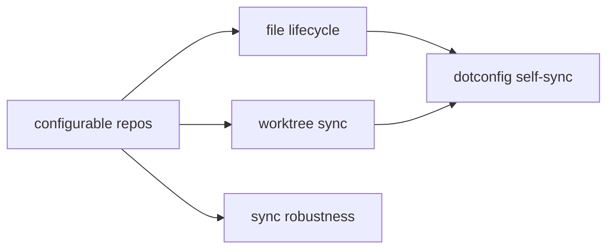

# Roadmap

## Obsidian notes syncing

Bidirectional sync between st0x source repos and a unified Obsidian vault so all
markdown is browsable and editable from one place. Currently works for three
hardcoded repos with fswatch-based continuous monitoring via launchd.

- [x] Extract md-sync into standalone nix package (`nix run .#mdSync`)
- [x] Sync st0x repos (liquidity, issuance, rest.api) to per-repo subdirectories
- [x] fswatch-based continuous sync
- [x] Deploy as launchd service
- [x] Bidirectional sync (repo ↔ notes) with timestamp-based conflict resolution

### Configurable repo list

- [ ] Move hardcoded `repos=(liquidity issuance rest.api)` to a declarative Nix
      option so adding a repo is a one-line config change
- [ ] Auto-discover repos: scan `~/code/st0x/st0x.*` for git repos containing
      `.md` files instead of maintaining a manual list

### Worktree sync

- [ ] Detect `.worktrees/` directories inside each repo and sync their markdown,
      appending repo name to filenames per naming convention (`docs/file.md` →
      `docs/file.liquidity.md`)
- [ ] Watch for worktree creation/deletion and dynamically add/remove fswatch
      paths without restarting the service
- [ ] Handle worktree cleanup: remove notes subdirectory when a worktree is
      deleted

### File lifecycle

- [ ] Detect file deletion in repos (file tracked by git but removed from
      working tree) and remove the corresponding notes file
- [ ] Detect new `.md` files added to a repo — sync on next fswatch event
      without waiting for full `sync_all`
- [ ] Detect file deletion in notes and remove from repo (safeguard: only if the
      file is untracked or unchanged in git)
- [ ] Handle renames: detect via git and update the notes copy accordingly

### Dotconfig self-sync

- [ ] Sync `~/.config/*.md` → `notes/dotconfig/` (this repo's own markdown,
      including this roadmap)
- [ ] Exclude build artifacts and lock files

### Sync robustness

- [ ] Eliminate the one-bounce no-op: touch both files to the same timestamp
      after copying so the echo cycle doesn't fire
- [ ] Conflict detection: when both sides changed since last sync, log a warning
      instead of silently picking the newer file
- [ ] Atomic writes: write to temp file then rename to avoid partial reads
- [ ] Dedup fswatch events: multiple rapid events for the same file should
      coalesce into a single sync

### Obsidian frontmatter

- [ ] Inject YAML frontmatter on sync to notes (repo, tags for doc type,
      version)
- [ ] Strip frontmatter on sync back to repo so source files stay clean

### Logging and observability

- [ ] Structured log format with consistent fields (timestamp, direction, repo,
      file, adds, dels)
- [ ] Log rotation or size cap to prevent unbounded growth
- [ ] Health check: periodic heartbeat so absence of logs is distinguishable
      from "service died silently"

## Git hooks via git-hooks.nix

Declarative pre-commit hooks managed by git-hooks.nix so formatting, linting,
and checks run automatically on commit across all repos without manual setup.

- [ ] Add git-hooks.nix to the flake inputs
- [ ] Configure hooks (nixfmt, denofmt, etc.)
- [ ] Integrate with direnv so hooks activate per-project

## Not epic

- [ ] Remove `rsync` from `runtimeInputs` — replaced by `diff`+`cp` but still
      listed as a dependency
- [ ] Clean up `dump.md` planning doc once roadmap covers everything

## Emacs Graphite Plugin

Build a magit extension for Graphite (`magit-graphite.el`). Transient-based UI
wrapping `gt` commands with magit-style UX.

### Core transient

- [ ] Transient menu accessible from magit dispatch (`G` prefix or similar)
- [ ] `gt create`, `gt modify`, `gt submit`, `gt co`, `gt sync` wrappers
- [ ] Stack visualization (`gt ls` / `gt ll` output in a buffer)

### Magit integration

- [ ] Stack status section in magit-status buffer
- [ ] Per-branch PR status (draft/open/merged)
- [ ] Submit from magit with publish/draft toggle

### Full workflow

- [ ] `gt absorb` integration with magit staging
- [ ] `gt reorder` / `gt move` via interactive UI
- [ ] PR review status from Graphite API

## AI Automation

Once the plugin is stable and the workflow is familiar, switch from "ask user to
run commands" to letting the AI run `gt` commands directly.
